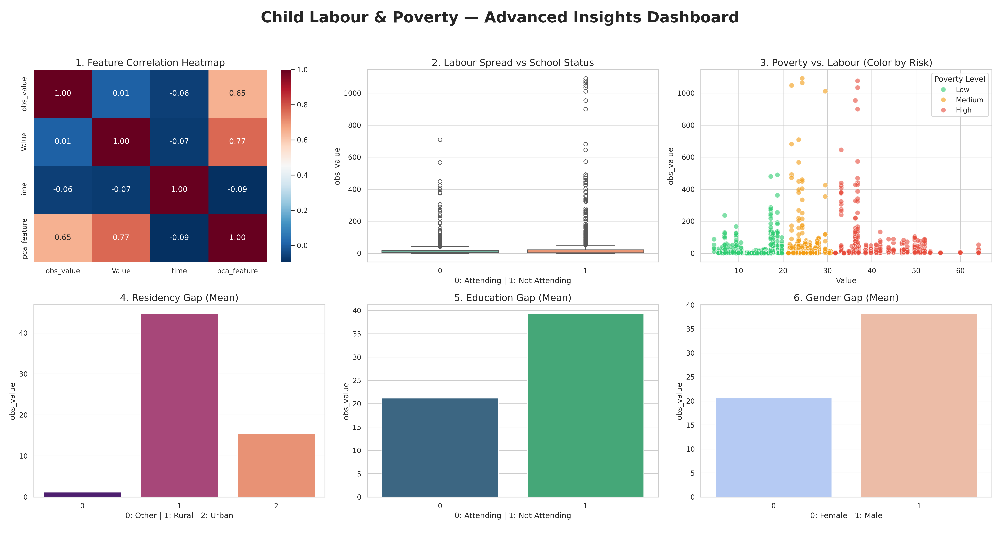

# CSCI461 — Introduction to Big Data
## Assignment #1 — Child Labour & Poverty Analytics Pipeline
### Spring 2026 — Nile University

---

## Team Members

| Name | Student ID | Section |
|------|-----------|---------|
| Yassmin Ahmed | 231001654 | 1A |
| Zeina Mohamed | 2310010039 | 1A |
| Mario Sameh | 231001484 | 1B |
| Youssef Mahmoud | 231000615 | 1B |

---

## Dataset

| Source | File |
|--------|------|
| ILO — Children attending school & working | `CLD_XHAS_SEX_AGE_GEO_NB_A-filtered-2026-03-19.csv` |
| ILO — Children NOT attending school & working | `CLD_XHAN_SEX_AGE_GEO_NB_A-filtered-2026-03-19.csv` |
| World Bank — Poverty Headcount Ratio | `4909ea2f-5255-49a2-811e-5583974af6ab_Data.csv` |

> **Raw datasets**: Neither file was cleaned or preprocessed before ingestion. All missing value handling, encoding, and scaling was performed by our pipeline.

The two ILO files are combined into `combined_child_labor.csv`, then merged with World Bank data on `(Country Name, Year)` to produce `data_raw.csv` — **4,580 raw rows, 19 columns**.

---

## Project Structure

```
customer-analytics/
├── Dockerfile          # Container — python:3.11-slim + all libraries
├── ingest.py           # Step 1 — Load raw CSV → data_raw.csv
├── preprocess.py       # Step 2 — 13 preprocessing tasks → data_preprocessed.csv
├── analytics.py        # Step 3 — Generate 3 textual insights
├── visualize.py        # Step 4 — Generate 3 plots → summary_plot.png
├── cluster.py          # Step 5 — K-Means (k=3) → clusters.txt
├── summary.sh          # Copy all outputs to host & stop container
├── README.md           # This file
└── results/
    ├── data_raw.csv
    ├── data_preprocessed.csv
    ├── insight1.txt
    ├── insight2.txt
    ├── insight3.txt
    ├── clusters.txt
    └── summary_plot.png
```

---

## Execution Flow

Each script calls the next automatically via `subprocess.run()`, passing the latest CSV path as argument:

```
ingest.py  (combined_child_labor.csv)
    └─▶ saves data_raw.csv
    └─▶ calls preprocess.py data_raw.csv

preprocess.py
    └─▶ 13 tasks across 4 stages
    └─▶ saves data_preprocessed.csv
    └─▶ calls analytics.py data_preprocessed.csv

analytics.py
    └─▶ saves insight1.txt, insight2.txt, insight3.txt
    └─▶ calls visualize.py data_preprocessed.csv

visualize.py
    └─▶ saves summary_plot.png
    └─▶ calls cluster.py data_preprocessed.csv

cluster.py
    └─▶ saves clusters.txt
    └─▶ Pipeline complete ✓
```

---

## Docker Commands

### Step 0 — Prepare combined CSV (outside Docker, once)

```bash
python3 - <<'EOF'
import pandas as pd

df_att = pd.read_csv("CLD_XHAS_SEX_AGE_GEO_NB_A-filtered-2026-03-19.csv")
df_not = pd.read_csv("CLD_XHAN_SEX_AGE_GEO_NB_A-filtered-2026-03-19.csv")
df_att['school_status'] = 'Attending'
df_not['school_status'] = 'Not Attending'
df_combined = pd.concat([df_att, df_not], ignore_index=True)

df_poverty = pd.read_csv("4909ea2f-5255-49a2-811e-5583974af6ab_Data.csv")
df_poverty['Time'] = pd.to_numeric(df_poverty['Time'].str.extract(r'(\d{4})')[0])
df_combined['time'] = df_combined['time'].astype(int)

df_master = pd.merge(
    df_combined, df_poverty,
    left_on=['ref_area.label', 'time'],
    right_on=['Country Name', 'Time'],
    how='inner'
)
df_master.to_csv("combined_child_labor.csv", index=False)
print(f"Saved: {df_master.shape}")
EOF
```

### Step 1 — Build the Docker Image

```bash
docker build -t child-labor-pipeline .
```

### Step 2 — Run the Container

```bash
docker run -dit \
  --name child-labor-pipeline \
  -v "$(pwd):/app/pipeline" \
  child-labor-pipeline
```

> `-v` mounts the current directory into the container so all generated outputs appear directly on the host.

### Step 3 — Execute the Pipeline

```bash
docker exec child-labor-pipeline python ingest.py combined_child_labor.csv
```

### Step 4 — Copy Outputs & Clean Up

```bash
chmod +x summary.sh && ./summary.sh
```

---

## Sample Output

### Terminal output (docker exec)

```
[ingest.py] Loading dataset from: combined_child_labor.csv
[ingest.py] Shape: 4580 rows x 19 columns
[ingest.py] Duplicates: 0
[ingest.py] Saved raw data to: data_raw.csv
[preprocess.py] Task 1: Forward-filled missing 'Value' by country.
[preprocess.py] Task 2: Removed 0 duplicate rows.
[preprocess.py] Task 3: Dropped metadata columns.
[preprocess.py] Task 4: Cleaned string prefixes from age_group and residency.
[preprocess.py] Task 5: Converted to numeric, shape now: (1998, 12)
[preprocess.py] Task 6: Label-encoded sex, school_status, residency.
[preprocess.py] Task 7: Standard scaled obs_value and Value.
[preprocess.py] Task 8: Selected 8 modeling columns.
[preprocess.py] Task 9: PCA applied. Explained variance: 50.13%
[preprocess.py] Task 10: Filtered to 2010+. Removed 192 rows.
[preprocess.py] Task 11: Discretized poverty into Low/Med/High.
[preprocess.py] Task 12: Discretized child labour into Low/Med/High.
[preprocess.py] Task 13: Created high_risk_flag binary column.
[preprocess.py] Final shape: (1806, 12)
[analytics.py] Saved insight1.txt
[analytics.py] Saved insight2.txt
[analytics.py] Saved insight3.txt
[visualize.py] Saved plot to: summary_plot.png
[cluster.py] Clustering on features: ['labour_scaled', 'poverty_scaled', 'school_enc'] — 1806 records
[cluster.py] Cluster counts:
cluster
0    1202
1     556
2      48
[cluster.py] Pipeline complete!
```

### Sample insight1.txt

```
=== INSIGHT 1: Poverty & Child Labour Correlation ===

Pearson Correlation between Poverty Rate and Child Labour Count: 0.0081

Interpretation:
  - Weak or no linear correlation detected (r ≈ 0.008).
  - Child labour is driven by multiple structural factors:
      * Lack of access to education
      * Weak enforcement of child labour laws
      * Rural vs urban population distribution
```

### Sample clusters.txt

```
=== K-Means Clustering Results (k=3) ===

Cluster 0 (Low Labour / Low Poverty):    1202 records
Cluster 1 (Medium Risk):                  556 records
Cluster 2 (High Labour / High Poverty):    48 records
```

---

## Preprocessing Steps (13 Tasks)

| # | Stage | Task |
|---|-------|------|
| 1 | Cleaning | Forward-fill missing poverty values grouped by country |
| 2 | Cleaning | Remove duplicate rows |
| 3 | Cleaning | Drop irrelevant metadata columns |
| 4 | Cleaning | Strip string prefixes from `age_group` and `residency` |
| 5 | Transformation | Convert `Value` and `obs_value` to float; drop NaNs |
| 6 | Transformation | Label-encode `sex`, `school_status`, `residency` |
| 7 | Transformation | Standard-scale `obs_value` and `Value` for K-Means |
| 8 | Dim. Reduction | Select only modeling-relevant columns |
| 9 | Dim. Reduction | Apply PCA → single vulnerability index (50.13% variance) |
| 10 | Dim. Reduction | Filter dataset to 2010 and later |
| 11 | Discretization | Bin poverty rate into Low / Med / High |
| 12 | Discretization | Bin child labour count into Low / Med / High |
| 13 | Discretization | Create binary `high_risk_flag` |

---

## Analytics Insights

**Insight 1** — Pearson correlation (r = 0.008) between poverty rate and child labour. Weak correlation indicates poverty alone does not determine child labour outcomes; structural factors like education access and law enforcement are equally critical.

**Insight 2** — Mean child labour by residency area, school attendance, and sex. Children not attending school average 39.3K vs 21.2K for those attending (85% gap) — confirming education access as the strongest categorical driver.

**Insight 3** — High-risk segment analysis: only 7.1% of records (128/1,806) qualify as high-risk (above-average in both poverty and labour). Cross-tabulation of poverty level × labour intensity reveals where intervention is most needed.

---

## Visualizations (`summary_plot.png`)

| # | Type | Description |
|---|------|-------------|
| 1 | Correlation Heatmap | Correlation matrix: Child Labour, Poverty Rate, Year, Vulnerability Index |
| 2 | Boxplot | Child labour distribution by school attendance status |
| 3 | Scatter | Poverty rate vs child labour count, coloured by poverty level |
-----


---

## Clustering (`clusters.txt`)

- **Algorithm:** K-Means (`k=3`, `random_state=42`, `n_init='auto'`)
- **Features:** `labour_scaled`, `poverty_scaled`, `school_enc`

| Cluster | Label | Records |
|---------|-------|---------|
| 0 | Low Labour / Low Poverty | 1,202 |
| 1 | Medium Risk | 556 |
| 2 | High Labour / High Poverty | 48 |

---

## Bonus

- **Docker Hub:** `docker pull yassmin10/child-labor-pipeline`
- **GitHub:** [github.com/YassminAhmed10/Big-Data](https://github.com/YassminAhmed10/Big-Data)
